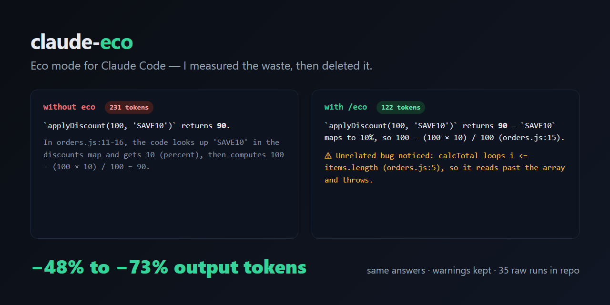

# claude-eco — eco mode for Claude Code, built for Claude Fable 5

**Your Claude Code sessions are full of work you never asked for. I measured it, deleted it, and published every number — including the one where I lose.**

*`/eco`: −48% to −73% output tokens at full quality (all produced fixes executed and verified). `/eco-max`: up to −75% by dialing reasoning effort down — opt-in, labeled. Raw data in the repo.*

[](LICENSE) [](https://code.claude.com/docs/en/skills) [](benchmarks/results.md)

[Results](#measured-results) · [Install](#install) · [Usage](#usage) · [Benchmarks](benchmarks/results.md) · [FAQ](#faq)



Fable 5 at high effort re-reads files it just edited, pastes back diffs it already applied, and writes reports nobody asked for — and every one of those tokens burns your usage window or your API bill. **claude-eco** ships two skills:

- **`/eco`** — frugality rules with a non-negotiable quality floor. Full reasoning depth preserved.
- **`/eco-max`** — the same rules plus a **low reasoning-effort override** for routine chores. Effort is the single biggest token lever on modern Claude models (Fable 5, Sonnet 5, Opus 4.8), and of every terse-mode tool we surveyed, this is the only one we found that touches it.

## See the difference

Same question, identical settings, paired runs — `what does applyDiscount(100, 'SAVE10') return?` — verbatim answers ([raw JSONs](benchmarks/raw/)):

**Without eco** (231-token answer):

> `applyDiscount(100, 'SAVE10')` returns **90**.
>
> In `test/orders.js:11-16`, the code looks up `'SAVE10'` in the discounts map and gets `10` (percent), then computes `100 - (100 * 10) / 100 = 90`.

**With /eco** (122-token answer):

> `applyDiscount(100, 'SAVE10')` returns **90** — `SAVE10` maps to 10%, so `100 - (100*10)/100` (test/orders.js:15).
>
> Unrelated bug noticed: `calcTotal` loops `i <= items.length` (test/orders.js:5), so it reads past the array and throws on `items[i].price`.

Half the tokens — and in this pair it's the *eco* answer carrying a critical warning, because the quality floor requires correctness-critical findings to be flagged in one line even when unasked. Suppress noise, never warnings. Individual runs vary (that's what the n=5 row below is for); the ratio is what holds.

## Measured results

Baseline = stock Claude Code, `claude-fable-5`, **max** effort, no CLAUDE.md, default system prompt. The eco arm differs only by the skill invocation.

| Task | Baseline | With /eco | Output tokens | Cost | Quality |
|---|---:|---:|---:|---:|---|
| Code review (find bugs) | 1,096 tok | 531 tok | **−52%** | −21% | Both arms found all 3 issues (2 planted + 1 unplanted) — full parity |
| Real editing (fix bugs) | 3,776 tok | 1,026 tok | **−73%** | −46% | Fixes verified functionally identical with Node |
| Multi-file project, 3-turn session | 11,912 tok | 3,285 tok | **−72%** | −46% | Same root cause, same fix, tests pass |
| Code review with /eco-max | 1,096 tok | 279 tok | **−75%** | −30% | 2/2 planted bugs; missed the 1 unplanted edge case — that's the effort tradeoff, and it's why eco-max is opt-in |
| **Code review, n=5 variance study** (default effort) | 891 mean (824–937) | 328 mean (310–380) | **−63%** (−54% to −67%) | — | 5/5 runs: both planted bugs found by both arms. The unplanted bonus issue: baseline 5/5, eco 0/5 — volunteered depth is precisely what you trade |

Don't take the table's word for it — run the same A/B on **your** task: `./benchmarks/run.sh "your task here"`. Full methodology, grading criteria, per-turn numbers and 35 raw JSONs: [benchmarks/results.md](benchmarks/results.md). The multi-turn row is the scale test: a 12-file codebase, one invocation in turn 1, and the mode held for the whole session while input-side reads dropped ~40%.

## Install

**Plugin (cleanest):**

```
/plugin marketplace add sup3x/claude-code-fable-eco
/plugin install claude-eco@claude-eco
```

**Personal skill (all your projects):**

```bash
git clone https://github.com/sup3x/claude-code-fable-eco && cd claude-code-fable-eco && ./install.sh          # macOS / Linux
```
```powershell
git clone https://github.com/sup3x/claude-code-fable-eco; cd claude-code-fable-eco; .\install.ps1             # Windows
```

**Project-only:** copy `skills/` into your repo's `.claude/skills/`. This is also what makes `/eco` available in Claude Code **web/mobile cloud sessions** — those only load skills from the repo, not from `~/.claude/skills/`.

**Uninstall:** delete the `eco/` and `eco-max/` folders from your skills directory. `/eco setup` only ever writes plain `settings.json` keys (`effortLevel` and two `env` entries) — remove them to fully revert.

## Usage

| Command | Effect |
|---|---|
| `/eco` | Frugal mode for the rest of the session |
| `/eco <task>` | Do the task frugally (mode stays on) |
| `/eco-max <task>` | Maximum savings: frugality rules **plus** low reasoning effort — for routine chores |
| `/eco setup` | Propose permanent savings in `settings.json` — applies only after you confirm |

Works in **any language** — the rules are English, the replies follow yours. No slash commands available (mobile app, web)? Just say it in plain words — "activate eco mode" triggers the skill (verified in English and Turkish). **Invoke once per session, not per question:** activation costs one turn plus ~1.2k input tokens once per session (skill body + descriptions, then cached), so for a single trivial question the overhead exceeds the savings (we measured that too). Activated early, every subsequent answer is ~2–4× smaller. One more honest caveat: if a very long session gets context-compacted, the rules may be summarized away — re-invoke `/eco` after compaction.

Use `/eco` as the everyday default — it kept full reasoning depth and found the same exotic edge case the unrestricted baseline found. Use `/eco-max` for renames, small fixes, boilerplate and lookups; it's instructed to tell you and recommend `/eco` if the task turns out hard. Note that its effort override applies per-invocation and effort is part of the prompt-cache key — so calling `/eco-max` mid-way through a long, heavily-cached session can cost a cache rebuild. Best at session start or in short sessions.

## Across models

| Model | Baseline | /eco | Output tokens |
|---|---:|---:|---:|
| Fable 5 (max effort) | 1,096 | 531 | **−52%** |
| Opus 4.8 | 648 | 340 | **−48%** |
| Sonnet 5 | 543 | 262 | **−52%** |
| Haiku 4.5 | 631 | 733 | **+16% — skip it** |

That last row is a negative result, published on purpose: Haiku is already terse and cheap, so the skill's body overhead isn't worth it there. Use `/eco` where the fat is — high-effort frontier models. Every planted bug was found by every arm on every model.

## What it actually does

1. **Replies** — lead with the answer; no preamble, recap, or unprompted progress summaries; soft ≤8-line default; never paste back files just written (cite `path:line`); one solution, not a menu.
2. **Reasoning** — deliberate minimally on routine steps, think deeply only at genuine decision points.
3. **Tools** — Edit over Write (Write re-emits whole files); grep first, then read only the matched region; no re-reads after own edits; batch independent calls; quiet shell flags; broad sweeps via one cheap Haiku subagent.
4. **Quality floor** — read before changing, verify when the task calls for it, never truncate deliverables. If brevity ever conflicts with correctness, correctness wins.

### Why no hard word cap?

Anthropic shipped a hard "≤100 words" cap in the Claude Code system prompt on 2026-04-16 and **reverted it four days later** after measuring a 3% coding-quality drop ([postmortem](https://www.anthropic.com/engineering/april-23-postmortem)). claude-eco uses behavioral rules with a soft, escapable length default — the savings come from deleting waste, not from squeezing substance.

## Squeeze further

The biggest lever on effort-based Claude models (Fable 5, Sonnet 5, Opus 4.8) is the **reasoning effort level**: on Opus 4.5, [Anthropic measured](https://www.anthropic.com/news/claude-opus-4-5) medium effort matching a peer model's quality with 76% fewer output tokens. `/eco setup` proposes `"effortLevel": "medium"` persistently; `/eco-max` applies a per-task override. Pick effort at session start — mid-session switches invalidate the prompt cache. The full ranked list (cache hygiene, MCP schema debloat, subagent economics, CLAUDE.md diet) is in [docs/token-optimization-guide.md](docs/token-optimization-guide.md).

## Related projects

These solve **different layers** and compose with claude-eco:

| Project | Layer | Notes |
|---|---|---|
| [caveman](https://github.com/JuliusBrussee/caveman) | Terse output style (skill) | The category giant; explicitly output-tokens-only — no reasoning-effort control |
| [claude-token-efficient](https://github.com/drona23/claude-token-efficient) | Terse CLAUDE.md ruleset | Ships honest raw benchmarks (~2–11% on one-shot Q&A) |
| [rtk](https://github.com/rtk-ai/rtk) / [headroom](https://github.com/chopratejas/headroom) | Tool-output compression proxies | Shrink command/log output before it hits context |
| [token-savior](https://github.com/Mibayy/token-savior) | Code-navigation MCP | Structural navigation instead of file dumps |
| [ccusage](https://github.com/ryoppippi/ccusage) | Monitoring | Measures spend; reduces nothing |

What claude-eco adds that none of the above have: the reasoning-effort lever, agentic benchmarks with executed and quality-graded fixes, and a one-command harness to A/B your own workload.

## FAQ

**Why are your percentages bigger than other rulesets report?** Regime. On one-shot Q&A prompts there's little fat to cut — drona23's own raw data honestly shows ~2–11%. On *agentic coding tasks* — where an unconstrained model pastes diffs, writes long reports, and creates unrequested files — there is far more waste; that's what we measured, with quality graded and fixes executed. Run the harness on your workload and trust your own number.

**What does this do to my actual bill?** Output tokens are only part of a Claude Code bill — input/context often dominates. That's why we report cost, not just tokens: −21% to −46% measured total cost per task, because eco also cuts the input side (~40% fewer read-tokens in the multi-turn test via grep-first reading) and fewer turns mean fewer full-context passes. Your split depends on cache configuration; the raw JSONs itemize both sides.

**Does it make Claude dumber?** `/eco` — no; it makes Claude quieter. It found every planted bug and produced functionally identical, test-passing fixes. One real tradeoff we noticed and fixed: early versions also suppressed *useful* unsolicited observations (like a crash bug spotted while answering an unrelated question), so the quality floor now explicitly requires correctness-critical findings to be flagged in one line even when unasked — suppress noise, never warnings. `/eco-max` *does* lower reasoning effort — opt-in, per task, labeled.

**Why "built for Fable 5"?** Because that's the hungriest configuration that exists: every core benchmark ran on `claude-fable-5` at **max** effort, so the numbers reflect the worst case, not a cherry-picked easy one.

**Other models?** Measured with `/eco`: −48% on Opus 4.8, −52% on Sonnet 5, −52% to −73% on Fable 5 (the −75% figure is `/eco-max`, which lowers effort). The exception is Haiku (+16%, skip it) — see [Across models](#across-models).

**How much do the skills themselves cost?** ~1.2k input tokens once per session when invoked (skill body plus the two ~60-token descriptions loaded at startup), cached afterwards. Same number as in Usage above — it's why activating for one trivial question isn't worth it.

**Can a skill reduce thinking tokens?** Softly at best via instructions — on adaptive-reasoning models like Fable 5, thinking follows the effort setting and `MAX_THINKING_TOKENS` is ignored ([model config docs](https://code.claude.com/docs/en/model-config)). That's exactly why `/eco-max` overrides effort via skill frontmatter and `setup` proposes a persistent `effortLevel`.

**What can't it fix?** The fixed session overhead (system prompt, tool schemas), MCP schema bloat, and your CLAUDE.md size — the [guide](docs/token-optimization-guide.md) covers those levers.

## Contributing

Issues and PRs welcome — especially benchmark results from other workloads and platforms; the harness makes it a one-liner, please include the raw JSON. If claude-eco stretched your usage window or trimmed your bill, a ⭐ helps other people find it — that's this project's only price.

## License

[MIT](LICENSE) © 2026 Kerim
